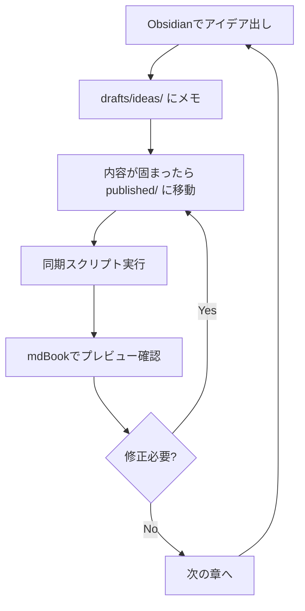

# Obsidian + mdBook + Kindle 本執筆システム 完全ガイド

## 概要

このドキュメントは、Obsidian、mdBook、Pandocを組み合わせた本執筆・出版システムの構築方法を説明します。

### システムの特徴

- **Obsidian**: アイデア出し、下書き、メモ管理
- **mdBook**: Web形式でのプレビューと確認
- **Pandoc**: Kindle本（EPUB）の生成
- **GitHub**: バージョン管理とバックアップ

### ワークフロー図

```
[Obsidian vault]
    ├── drafts/（アイデア・下書き）
    └── published/（本のメイン内容）
           ↓
    [同期スクリプト]
           ↓
    [mdBook src/]（Web版プレビュー）
           ↓
    [Pandoc]（Kindle本生成）
           ↓
    [book.epub]（Kindle Direct Publishing へアップロード）
```

---

## 1. プロジェクト構造

### 完全なディレクトリ構造

```
my-book/
├── .git/                           # Gitリポジトリ
├── .gitignore                      # Git除外設定
│
├── obsidian/                       # Obsidian vault（執筆環境）
│   ├── .obsidian/                 # Obsidian設定ファイル
│   │   ├── app.json
│   │   ├── workspace.json
│   │   └── plugins/
│   │
│   ├── drafts/                    # アイデア・下書きエリア
│   │   ├── index.md              # 進捗管理ページ
│   │   ├── ideas/                # アイデアメモ
│   │   │   ├── idea-001.md
│   │   │   └── idea-002.md
│   │   ├── research/             # リサーチノート
│   │   │   ├── research-001.md
│   │   │   └── research-002.md
│   │   └── outlines/             # 章の構成案
│   │       └── book-outline.md
│   │
│   ├── published/                 # 本のメイン内容（公開用）
│   │   ├── 00-introduction.md
│   │   ├── 01-chapter-1.md
│   │   ├── 02-chapter-2.md
│   │   ├── 03-chapter-3.md
│   │   ├── 99-conclusion.md
│   │   └── images/               # 画像ファイル
│   │       ├── figure-1.png
│   │       └── figure-2.png
│   │
│   ├── templates/                 # テンプレート
│   │   ├── chapter-template.md
│   │   ├── idea-template.md
│   │   └── research-template.md
│   │
│   └── attachments/               # 添付ファイル
│
├── src/                           # mdBook用ソースファイル
│   ├── SUMMARY.md                # mdBookの目次（自動生成）
│   ├── 00-introduction.md        # published/ から同期
│   ├── 01-chapter-1.md           # published/ から同期
│   ├── 02-chapter-2.md           # published/ から同期
│   └── images/                   # published/images から同期
│
├── book.toml                      # mdBook設定ファイル
├── metadata.yaml                  # Pandoc用メタデータ
├── cover.jpg                      # Kindle本の表紙画像
│
├── styles/                        # スタイルシート
│   ├── epub.css                  # EPUB用CSS
│   └── mdbook.css                # mdBook用カスタムCSS（オプション）
│
├── scripts/                       # 自動化スクリプト
│   ├── sync-to-mdbook.sh         # Obsidian → mdBook 同期
│   ├── build-kindle.sh           # Kindle本ビルド
│   ├── watch-and-sync.sh         # 自動同期（オプション）
│   └── validate-links.sh         # リンク検証（オプション）
│
├── dist/                          # 出力ファイル
│   ├── html/                     # mdBookのHTML出力
│   └── book.epub                 # Kindle用EPUB
│
├── .github/                       # GitHub Actions（オプション）
│   └── workflows/
│       └── build.yml
│
├── README.md                      # プロジェクト説明
└── CHANGELOG.md                   # 変更履歴
```

---

## 2. セットアップ手順

### 2.1 必要なツールのインストール

#### macOS の場合

```bash
# Homebrewのインストール（未インストールの場合）
/bin/bash -c "$(curl -fsSL https://raw.githubusercontent.com/Homebrew/install/HEAD/install.sh)"

# Rustのインストール（mdBookに必要）
curl --proto '=https' --tlsv1.2 -sSf https://sh.rustup.rs | sh
source $HOME/.cargo/env

# mdBookのインストール
cargo install mdbook

# Pandocのインストール
brew install pandoc

# fswatch（自動同期用、オプション）
brew install fswatch

# rsync（同期に使用、通常はプリインストール済み）
# 確認: rsync --version
```

#### Linux (Ubuntu/Debian) の場合

```bash
# Rustのインストール
curl --proto '=https' --tlsv1.2 -sSf https://sh.rustup.rs | sh
source $HOME/.cargo/env

# mdBookのインストール
cargo install mdbook

# Pandocのインストール
sudo apt-get update
sudo apt-get install -y pandoc

# inotify-tools（自動同期用、オプション）
sudo apt-get install -y inotify-tools

# rsync
sudo apt-get install -y rsync
```

#### Windows の場合

```powershell
# Chocolateyを使用（未インストールの場合は公式サイトから）
choco install rust
choco install pandoc

# mdBookのインストール
cargo install mdbook

# rsync代替としてrobocopyを使用（Windows標準搭載）
```

#### Obsidianのインストール

- [Obsidian公式サイト](https://obsidian.md/)からダウンロードしてインストール

---

### 2.2 プロジェクトの初期化

```bash
# プロジェクトディレクトリの作成
mkdir my-book
cd my-book

# Gitリポジトリの初期化
git init

# mdBookプロジェクトの初期化
mdbook init --title "あなたの本のタイトル"

# Obsidian用ディレクトリの作成
mkdir -p obsidian/drafts/ideas
mkdir -p obsidian/drafts/research
mkdir -p obsidian/drafts/outlines
mkdir -p obsidian/published/images
mkdir -p obsidian/templates
mkdir -p obsidian/attachments

# スクリプトディレクトリの作成
mkdir scripts

# 出力ディレクトリの作成
mkdir -p dist

# スタイルシートディレクトリの作成
mkdir styles
```

---

### 2.3 設定ファイルの作成

#### `book.toml` (mdBook設定)

```toml
[book]
title = "あなたの本のタイトル"
authors = ["著者名"]
language = "ja"
multilingual = false
src = "src"

[build]
build-dir = "dist/html"

[output.html]
default-theme = "light"
preferred-dark-theme = "navy"
git-repository-url = "https://github.com/your-username/my-book"
edit-url-template = "https://github.com/your-username/my-book/edit/main/{path}"

[output.html.search]
enable = true
limit-results = 30
use-boolean-and = true
boost-title = 2
boost-hierarchy = 1
boost-paragraph = 1
expand = true
heading-split-level = 3
```

#### `metadata.yaml` (Pandoc/Kindle用)

```yaml
---
title: "あなたの本のタイトル"
subtitle: "サブタイトル（オプション）"
author:
  - "著者名"
publisher: "出版社名（セルフパブリッシングの場合は著者名）"
language: ja
rights: "© 2026 著者名. All rights reserved."
description: |
  本の説明文をここに記載します。
  複数行にわたって書くこともできます。
keywords: [キーワード1, キーワード2, キーワード3]
cover-image: cover.jpg
stylesheet: styles/epub.css
---
```

#### `.gitignore`

```gitignore
# ビルド成果物
book/
dist/html/
target/
*.epub
*.mobi

# Obsidian
.obsidian/workspace*
.obsidian/cache/
.obsidian/*.json.bak
.trash/

# 個人的なメモ（必要に応じてコメントアウト解除）
# obsidian/drafts/private/

# macOS
.DS_Store

# エディタ
*.swp
*.swo
*~
.vscode/
.idea/

# ログファイル
*.log

# 一時ファイル
tmp/
temp/
```

#### `styles/epub.css` (EPUB用スタイル)

```css
/* EPUBスタイルシート */

body {
    font-family: "Hiragino Kaku Gothic ProN", "ヒラギノ角ゴ ProN W3", Meiryo, メイリオ, sans-serif;
    line-height: 1.8;
    font-size: 1em;
    margin: 1em;
}

h1, h2, h3, h4, h5, h6 {
    font-weight: bold;
    line-height: 1.4;
    margin-top: 1.5em;
    margin-bottom: 0.5em;
}

h1 {
    font-size: 2em;
    border-bottom: 2px solid #333;
    padding-bottom: 0.3em;
}

h2 {
    font-size: 1.5em;
    border-bottom: 1px solid #666;
    padding-bottom: 0.2em;
}

h3 {
    font-size: 1.25em;
}

p {
    margin: 1em 0;
    text-indent: 1em;
}

code {
    background-color: #f4f4f4;
    padding: 0.2em 0.4em;
    border-radius: 3px;
    font-family: "Courier New", Courier, monospace;
    font-size: 0.9em;
}

pre {
    background-color: #f4f4f4;
    padding: 1em;
    border-radius: 5px;
    overflow-x: auto;
}

pre code {
    background-color: transparent;
    padding: 0;
}

blockquote {
    border-left: 4px solid #ccc;
    margin-left: 0;
    padding-left: 1em;
    color: #666;
    font-style: italic;
}

img {
    max-width: 100%;
    height: auto;
    display: block;
    margin: 1em auto;
}

a {
    color: #0066cc;
    text-decoration: none;
}

a:hover {
    text-decoration: underline;
}

ul, ol {
    margin: 1em 0;
    padding-left: 2em;
}

li {
    margin: 0.5em 0;
}

table {
    border-collapse: collapse;
    width: 100%;
    margin: 1em 0;
}

th, td {
    border: 1px solid #ddd;
    padding: 0.5em;
    text-align: left;
}

th {
    background-color: #f4f4f4;
    font-weight: bold;
}
```

---

### 2.4 Obsidianテンプレートの作成

#### `obsidian/templates/chapter-template.md`

```markdown
---
status: draft
created: {{date:YYYY-MM-DD}}
updated: {{date:YYYY-MM-DD}}
tags: [book, chapter]
word_count: 0
---

# {{title}}

## 概要
この章で伝えたいこと

## 本文

### セクション1


### セクション2


## まとめ


## メモ・TODO
- [ ] 要確認事項
- [ ] 追加したい内容

## 参考文献
-
```

#### `obsidian/templates/idea-template.md`

```markdown
---
created: {{date:YYYY-MM-DD}}
tags: [idea, draft]
status: brainstorming
---

# {{title}}

## アイデアの概要


## 詳細


## 関連するトピック
- [[]]

## 次のステップ
- [ ]
```

#### `obsidian/templates/research-template.md`

```markdown
---
created: {{date:YYYY-MM-DD}}
tags: [research]
source:
source_url:
---

# {{title}}

## 情報源


## 要点


## 引用


## 本への活用方法


## 関連ノート
- [[]]
```

---

### 2.5 Obsidian進捗管理ページ

#### `obsidian/drafts/index.md`

```markdown
# 執筆進捗管理

最終更新: {{date:YYYY-MM-DD}}

## 📊 全体の進捗

- 総章数: X章
- 完成章数: Y章
- 進捗率: Z%
- 総文字数: XXXX文字

## 💡 アイデア段階

### 新規アイデア
- [[ideas/idea-001]] - AIの未来について
- [[ideas/idea-002]] - プログラミング教育の課題

### 検討中
- [[ideas/idea-003]] - データプライバシー

## ✍️ 執筆中

### 優先度: 高
- [[published/01-chapter-1]] - 進捗: 80% - 期限: 2025-11-15
- [[published/02-chapter-2]] - 進捗: 30% - 期限: 2025-11-20

### 優先度: 中
- [[published/03-chapter-3]] - 進捗: 10% - 期限: 2025-11-25

## ✅ 完成・公開済み
- [[published/00-introduction]] ✅ 2025-11-01完成
- [[published/99-conclusion]] ✅ 2025-11-05完成

## 📚 リサーチ

### 進行中
- [[research/research-001]] - 市場調査
- [[research/research-002]] - 技術トレンド分析

### 完了
- [[research/research-003]] - 競合分析 ✅

## 📝 TODO

### 今週
- [ ] 第1章のレビュー
- [ ] 第2章の執筆継続
- [ ] 画像の準備

### 来週
- [ ] 第3章の構成案作成
- [ ] ベータリーダーへの依頼

## 🎯 マイルストーン

- [ ] 初稿完成: 2025-12-01
- [ ] レビュー完了: 2025-12-15
- [ ] 最終稿完成: 2025-12-31
- [ ] Kindle出版: 2026-01-15

## 📈 統計

```dataview
TABLE status, word_count, updated
FROM "published"
WHERE contains(tags, "chapter")
SORT file.name ASC
```

## 🔗 リンク

- [mdBookプレビュー](http://localhost:3000)
- [GitHubリポジトリ](https://github.com/your-username/my-book)
```

---

## 3. スクリプトの作成

### 3.1 `scripts/sync-to-mdbook.sh`

```bash
#!/bin/bash

# Obsidian → mdBook 同期スクリプト
# 使い方: bash scripts/sync-to-mdbook.sh

set -e  # エラーが発生したら停止

echo "========================================="
echo "Obsidian → mdBook 同期開始"
echo "========================================="

# ディレクトリの存在確認
if [ ! -d "obsidian/published" ]; then
    echo "エラー: obsidian/published ディレクトリが見つかりません"
    exit 1
fi

# src ディレクトリの作成（存在しない場合）
mkdir -p src

# ObsidianのpublishedフォルダからmdBookのsrcへ同期
echo "ファイルを同期中..."
rsync -av --delete \
  --exclude='.obsidian' \
  --exclude='.DS_Store' \
  --exclude='*.swp' \
  obsidian/published/ \
  src/

# SUMMARY.mdの自動生成
echo "SUMMARY.md を生成中..."

cat > src/SUMMARY.md << 'EOF'
# Summary

[はじめに](./00-introduction.md)

# 本編

EOF

# published内の章ファイルを順番に追加（00-introduction と 99-conclusion 以外）
for file in obsidian/published/[0-9][0-9]-*.md; do
  if [ -f "$file" ]; then
    basename=$(basename "$file")

    # はじめにと結論はスキップ
    if [[ "$basename" == "00-introduction.md" ]] || [[ "$basename" == "99-conclusion.md" ]]; then
      continue
    fi

    # Markdownの最初の見出し（# で始まる行）をタイトルとして抽出
    title=$(grep -m 1 '^# ' "$file" | sed 's/^# //' | sed 's/\[.*\]//')

    # タイトルが取得できない場合はファイル名を使用
    if [ -z "$title" ]; then
      title=$(echo "$basename" | sed 's/^[0-9][0-9]-//' | sed 's/.md$//' | sed 's/-/ /g')
    fi

    echo "- [$title](./$basename)" >> src/SUMMARY.md
  fi
done

# 結論を追加
if [ -f "obsidian/published/99-conclusion.md" ]; then
  echo "" >> src/SUMMARY.md
  echo "---" >> src/SUMMARY.md
  echo "" >> src/SUMMARY.md
  title=$(grep -m 1 '^# ' "obsidian/published/99-conclusion.md" | sed 's/^# //')
  if [ -z "$title" ]; then
    title="おわりに"
  fi
  echo "- [$title](./99-conclusion.md)" >> src/SUMMARY.md
fi

echo ""
echo "✅ 同期完了"
echo "同期されたファイル数: $(find src -name "*.md" ! -name "SUMMARY.md" | wc -l)"
echo ""
echo "mdBookでプレビューするには:"
echo "  mdbook serve"
echo ""
```

### 3.2 `scripts/build-kindle.sh`

```bash
#!/bin/bash

# Kindle本ビルドスクリプト
# 使い方: bash scripts/build-kindle.sh

set -e

echo "========================================="
echo "Kindle本（EPUB）ビルド開始"
echo "========================================="

# 必要なファイルの確認
if [ ! -f "metadata.yaml" ]; then
    echo "エラー: metadata.yaml が見つかりません"
    exit 1
fi

if [ ! -f "cover.jpg" ]; then
    echo "警告: cover.jpg が見つかりません。表紙なしでビルドします。"
    COVER_OPTION=""
else
    COVER_OPTION="--epub-cover-image=cover.jpg"
fi

# 出力ディレクトリの作成
mkdir -p dist

# Obsidian published フォルダから章ファイルを取得（番号順）
echo "章ファイルを収集中..."
FILES=$(find obsidian/published -name "[0-9][0-9]-*.md" | sort)

if [ -z "$FILES" ]; then
    echo "エラー: 章ファイルが見つかりません"
    exit 1
fi

echo "見つかった章:"
echo "$FILES"
echo ""

# Pandocでビルド
echo "EPUBを生成中..."
pandoc -o dist/book.epub \
  --from=markdown+smart \
  --to=epub3 \
  metadata.yaml \
  $FILES \
  --toc \
  --toc-depth=3 \
  $COVER_OPTION \
  --epub-metadata=metadata.yaml \
  --css=styles/epub.css \
  --highlight-style=tango \
  --resource-path=.:obsidian/published

echo ""
echo "✅ ビルド完了"
echo "出力ファイル: dist/book.epub"
echo ""

# ファイルサイズ表示
if [ -f "dist/book.epub" ]; then
    SIZE=$(du -h dist/book.epub | cut -f1)
    echo "ファイルサイズ: $SIZE"
    echo ""
    echo "次のステップ:"
    echo "1. Kindle Previewer で確認"
    echo "2. Kindle Direct Publishing (KDP) にアップロード"
    echo ""
fi
```

### 3.3 `scripts/watch-and-sync.sh` (オプション - 自動同期)

```bash
#!/bin/bash

# ファイル変更を監視して自動同期
# 使い方: bash scripts/watch-and-sync.sh

echo "========================================="
echo "自動同期モード起動"
echo "obsidian/published を監視中..."
echo "Ctrl+C で終了"
echo "========================================="

# macOS の場合
if command -v fswatch &> /dev/null; then
    fswatch -o obsidian/published | while read num; do
        echo ""
        echo "[$(date '+%Y-%m-%d %H:%M:%S')] 変更を検知。同期を開始..."
        bash scripts/sync-to-mdbook.sh
    done

# Linux の場合
elif command -v inotifywait &> /dev/null; then
    while inotifywait -r -e modify,create,delete,move obsidian/published; do
        echo ""
        echo "[$(date '+%Y-%m-%d %H:%M:%S')] 変更を検知。同期を開始..."
        bash scripts/sync-to-mdbook.sh
    done

else
    echo "エラー: fswatch (macOS) または inotifywait (Linux) がインストールされていません"
    echo ""
    echo "インストール方法:"
    echo "  macOS: brew install fswatch"
    echo "  Linux: sudo apt-get install inotify-tools"
    exit 1
fi
```

### 3.4 `scripts/validate-links.sh` (オプション - リンク検証)

```bash
#!/bin/bash

# Markdown内のリンクを検証
# 使い方: bash scripts/validate-links.sh

echo "========================================="
echo "リンク検証開始"
echo "========================================="

ERRORS=0

# obsidian/published 内の全.mdファイルをチェック
for file in obsidian/published/*.md; do
    if [ -f "$file" ]; then
        # [[ファイル名]] 形式のWikilink検証
        while IFS= read -r link; do
            # .md拡張子を追加して検索
            if [ ! -f "obsidian/published/${link}.md" ] && [ ! -f "obsidian/drafts/${link}.md" ]; then
                echo "❌ 壊れたリンク: $file -> [[${link}]]"
                ERRORS=$((ERRORS + 1))
            fi
        done < <(grep -o '\[\[\([^]]*\)\]\]' "$file" | sed 's/\[\[\(.*\)\]\]/\1/')

        # 画像リンクの検証
        while IFS= read -r image; do
            if [ ! -f "obsidian/published/images/${image}" ]; then
                echo "❌ 画像が見つかりません: $file -> $image"
                ERRORS=$((ERRORS + 1))
            fi
        done < <(grep -o '!\[.*\](\(images/[^)]*\))' "$file" | sed 's/.*(\(.*\))/\1/')
    fi
done

echo ""
if [ $ERRORS -eq 0 ]; then
    echo "✅ リンク検証完了: エラーなし"
else
    echo "⚠️  リンク検証完了: ${ERRORS}個のエラーが見つかりました"
fi
echo ""
```

### スクリプトに実行権限を付与

```bash
chmod +x scripts/*.sh
```

---

## 4. 執筆ワークフロー

### 4.1 日常的な執筆フロー



#### ステップ詳細

1. **Obsidianを起動して執筆**
   - `obsidian/drafts/` でアイデアを自由に書く
   - リンク、タグ、画像を活用
   - テンプレートを使用して構造化

2. **内容が固まったら `published/` に移動**
   ```bash
   # ファイル名は章番号を含める
   # 例: 01-chapter-name.md, 02-another-chapter.md
   ```

3. **mdBookで確認**
   ```bash
   # 同期
   bash scripts/sync-to-mdbook.sh

   # プレビュー起動
   mdbook serve

   # ブラウザで http://localhost:3000 を開く
   ```

4. **自動同期を使う場合（オプション）**
   ```bash
   # ターミナル1: 自動同期を起動
   bash scripts/watch-and-sync.sh

   # ターミナル2: mdBookサーバーを起動
   mdbook serve

   # これでObsidianで保存するたびに自動的にmdBookに反映される
   ```

---

### 4.2 Obsidianでの執筆テクニック

#### 双方向リンクの活用

```markdown
この概念は [[別の章]] で詳しく説明しています。

[[用語集#特定の項目]] を参照してください。
```

#### タグの活用

```markdown
---
tags: [book, chapter, review-needed, draft]
---
```

タグで検索・フィルタリングが可能：
- `#book` - 本関連
- `#draft` - 下書き
- `#review-needed` - レビュー待ち
- `#ready-to-publish` - 公開準備完了

#### Dataviewプラグインでの進捗管理

```markdown
## 執筆状況

```dataview
TABLE status, word_count, updated
FROM "obsidian/published"
WHERE contains(tags, "chapter")
SORT file.name ASC
```
```

#### カンバンボードでのタスク管理

Kanbanプラグインをインストールして：

```markdown
## 執筆カンバン

- [ ] アイデア
  - [ ] [[idea-001]]
  - [ ] [[idea-002]]
- [ ] 執筆中
  - [ ] [[chapter-01]]
- [ ] レビュー
  - [ ] [[chapter-02]]
- [ ] 完成
  - [x] [[introduction]]
```

---

### 4.3 画像の管理

#### 画像の配置

```
obsidian/published/images/
├── chapter-01-figure-01.png
├── chapter-01-figure-02.jpg
└── chapter-02-diagram.svg
```

#### Markdownでの画像挿入

```markdown


# サイズ指定（HTMLの場合）

```

#### 画像の最適化（推奨）

```bash
# ImageMagickを使用してリサイズ
mogrify -resize 1200x1200\> -quality 85 obsidian/published/images/*.jpg

# PNGの圧縮（optipng使用）
optipng -o7 obsidian/published/images/*.png
```

---

### 4.4 Kindle本の生成

#### ビルド前のチェックリスト

- [ ] 全章の執筆が完了
- [ ] 誤字脱字チェック完了
- [ ] 画像が正しく表示されるか確認
- [ ] リンクが正しく動作するか確認
- [ ] metadata.yaml の情報が正確か確認
- [ ] cover.jpg が用意されているか確認

#### EPUBの生成

```bash
# EPUBビルド
bash scripts/build-kindle.sh

# 出力確認
ls -lh dist/book.epub
```

#### Kindle Previewerでの確認

1. [Kindle Previewer](https://kdp.amazon.co.jp/ja_JP/help/topic/G202131170)をダウンロード
2. `dist/book.epub` を開く
3. 様々なデバイスでプレビュー
4. 問題があれば修正して再ビルド

#### 一般的な問題と対処法

**問題: 画像が表示されない**
```bash
# 画像パスの確認
# Markdownでは相対パスを使用
  # ✅ 正しい
 # ❌ 絶対パスは使わない
```

**問題: 目次が正しく生成されない**
```markdown
# 見出しレベルを適切に使用
# 第1章          # レベル1
## セクション1   # レベル2
### 小見出し     # レベル3
```

**問題: EPUBファイルサイズが大きすぎる**
```bash
# 画像を最適化
bash scripts/optimize-images.sh
```

---

## 5. Git/GitHubでのバージョン管理

### 5.1 初回コミット

```bash
# 初期化（未実施の場合）
git init

# .gitignore の追加
git add .gitignore

# 全ファイルの追加
git add .

# 初回コミット
git commit -m "Initial commit: プロジェクト構成とスクリプト"

# GitHubリポジトリの作成後
git remote add origin https://github.com/your-username/my-book.git
git branch -M main
git push -u origin main
```

### 5.2 日常的なコミット

```bash
# 変更の確認
git status

# 変更をステージング
git add obsidian/published/*.md
git add obsidian/drafts/*.md

# コミット
git commit -m "執筆: 第2章の初稿完成"

# プッシュ
git push
```

### 5.3 推奨コミットメッセージフォーマット

```
執筆: 第X章の初稿完成
修正: 第X章の誤字修正
追加: 新規アイデアメモ追加
更新: 第X章のリライト
画像: 第X章の図を追加
スクリプト: ビルドスクリプトの改善
設定: metadata.yamlの更新
リリース: v1.0.0 Kindle版公開
```

### 5.4 ブランチ戦略（オプション）

```bash
# 大きな変更の場合はブランチを作成
git checkout -b feature/chapter-3-rewrite

# 変更をコミット
git add .
git commit -m "リライト: 第3章の構成変更"

# mainブランチにマージ
git checkout main
git merge feature/chapter-3-rewrite
git push
```

---

## 6. GitHub Actions による自動化（オプション）

### 6.1 `.github/workflows/build.yml`

```yaml
name: Build and Deploy Book

on:
  push:
    branches: [ main ]
    tags: [ 'v*' ]
  pull_request:
    branches: [ main ]
  workflow_dispatch:  # 手動実行を許可

# GitHub Pages へのデプロイに必要な権限(最小権限の原則)
permissions:
  contents: read
  pages: write
  id-token: write

concurrency:
  group: "pages-${{ github.ref }}"
  cancel-in-progress: false

env:
  MDBOOK_VERSION: "0.5.3"  # mdBook のバージョンを固定(再現性のため)

jobs:
  build-mdbook:
    runs-on: ubuntu-latest
    steps:
    - name: Checkout
      uses: actions/checkout@v5

    - name: Install mdBook
      uses: taiki-e/install-action@v2  # プリビルドバイナリを取得(高速)
      with:
        tool: mdbook@${{ env.MDBOOK_VERSION }}

    - name: Sync Obsidian to mdBook
      run: bash scripts/sync-to-mdbook.sh

    - name: Build mdBook
      run: mdbook build

    - name: Setup Pages
      if: github.ref == 'refs/heads/main'
      uses: actions/configure-pages@v5

    - name: Upload Pages artifact
      if: github.ref == 'refs/heads/main'
      uses: actions/upload-pages-artifact@v3
      with:
        path: ./dist/html

  deploy-pages:
    needs: build-mdbook
    if: github.ref == 'refs/heads/main'
    runs-on: ubuntu-latest
    environment:
      name: github-pages
      url: ${{ steps.deployment.outputs.page_url }}
    steps:
    - name: Deploy to GitHub Pages
      id: deployment
      uses: actions/deploy-pages@v4

  build-kindle:
    runs-on: ubuntu-latest
    permissions:
      contents: write  # タグ push 時に Release を作成するために必要
    steps:
    - name: Checkout
      uses: actions/checkout@v5

    - name: Install Pandoc
      run: |
        sudo apt-get update
        sudo apt-get install -y pandoc

    - name: Build EPUB
      run: bash scripts/build-kindle.sh

    - name: Upload EPUB Artifact
      uses: actions/upload-artifact@v4
      with:
        name: kindle-book
        path: dist/book.epub
        retention-days: 30

    - name: Create Release (on tag)
      if: startsWith(github.ref, 'refs/tags/v')
      uses: softprops/action-gh-release@v2
      with:
        files: dist/book.epub
```

> **補足(旧バージョンからの変更点)**: `actions/upload-artifact@v3` は2025年1月に廃止されてビルドが失敗するため `@v4` へ更新。GitHub Pages へのデプロイは非公式の `peaceiris/actions-gh-pages` から公式の `configure-pages` / `upload-pages-artifact` / `deploy-pages` 方式へ移行。`actions-rs/toolchain`(アーカイブ済み)は廃止し、mdBook はプリビルドバイナリを取得する `taiki-e/install-action` でインストールします。カスタムドメインを使う場合は、リポジトリの Settings → Pages から設定してください。

### 6.2 GitHub Pagesの設定

1. GitHubリポジトリの Settings → Pages
2. Source: "GitHub Actions" を選択
3. プッシュ後、自動的に https://your-username.github.io/my-book/ で公開

---

## 7. トラブルシューティング

### 7.1 mdBookが起動しない

```bash
# mdBookのバージョン確認
mdbook --version

# 再インストール
cargo install mdbook --force

# book.tomlの文法チェック
mdbook build
```

### 7.2 同期スクリプトが動作しない

```bash
# rsyncの確認
which rsync
rsync --version

# 権限確認
chmod +x scripts/sync-to-mdbook.sh

# 手動実行してエラーメッセージ確認
bash -x scripts/sync-to-mdbook.sh
```

### 7.3 PandocでEPUBが生成されない

```bash
# Pandocのバージョン確認
pandoc --version

# 最新版にアップデート
# macOS
brew upgrade pandoc

# Linux
sudo apt-get update
sudo apt-get install --only-upgrade pandoc

# メタデータの確認
cat metadata.yaml

# シンプルなテストビルド
pandoc -o test.epub metadata.yaml obsidian/published/00-introduction.md
```

### 7.4 Obsidianでリンクが機能しない

- ファイル名に特殊文字（`/`, `:`, `*`, `?`, `"`, `<`, `>`, `|`）を使っていないか確認
- Wikilink形式（`[[ファイル名]]`）を使用しているか確認
- ファイルが正しいディレクトリにあるか確認

### 7.5 画像がEPUBで表示されない

```bash
# 画像パスの確認（相対パスを使用）
grep -r "!\[" obsidian/published/

# 画像ファイルの存在確認
ls -la obsidian/published/images/

# Pandocのリソースパス指定を確認
# scripts/build-kindle.sh 内の --resource-path オプション
```

---

## 8. 高度な活用方法

### 8.1 複数言語対応

```
my-book/
├── obsidian/
│   ├── published-ja/  # 日本語版
│   └── published-en/  # 英語版
├── src-ja/
├── src-en/
└── scripts/
    ├── sync-ja.sh
    └── sync-en.sh
```

### 8.2 校正ツールの統合

```bash
# textlintのインストール
npm install -g textlint
npm install -g textlint-rule-preset-ja-technical-writing

# .textlintrc の作成
cat > .textlintrc << EOF
{
  "rules": {
    "preset-ja-technical-writing": true
  }
}
EOF

# 校正実行
textlint "obsidian/published/**/*.md"
```

### 8.3 文字数カウント

```bash
# スクリプト作成: scripts/count-words.sh
#!/bin/bash
echo "=== 文字数カウント ==="
for file in obsidian/published/[0-9][0-9]-*.md; do
    if [ -f "$file" ]; then
        count=$(wc -m < "$file")
        echo "$(basename $file): ${count}文字"
    fi
done

# 総文字数
total=$(cat obsidian/published/[0-9][0-9]-*.md | wc -m)
echo ""
echo "総文字数: ${total}文字"
```

### 8.4 PDFの生成（オプション）

```bash
# LaTeX環境のインストール（必要に応じて）
# macOS
brew install --cask mactex-no-gui

# Linux
sudo apt-get install texlive-full

# PDFビルドスクリプト: scripts/build-pdf.sh
pandoc -o dist/book.pdf \
  --from=markdown \
  --template=eisvogel \
  --listings \
  metadata.yaml \
  obsidian/published/[0-9][0-9]-*.md
```

---

## 9. チェックリスト

### 9.1 セットアップチェックリスト

- [ ] mdBookインストール完了
- [ ] Pandocインストール完了
- [ ] Obsidianインストール完了
- [ ] プロジェクト構造作成完了
- [ ] 設定ファイル作成完了（book.toml, metadata.yaml）
- [ ] スクリプト作成完了（sync, build）
- [ ] スクリプトに実行権限付与
- [ ] .gitignore作成完了
- [ ] Gitリポジトリ初期化完了
- [ ] GitHubリポジトリ作成・接続完了

### 9.2 出版前チェックリスト

- [ ] 全章の執筆完了
- [ ] 誤字脱字チェック完了
- [ ] 画像の最適化完了
- [ ] リンク検証完了（`bash scripts/validate-links.sh`）
- [ ] metadata.yaml の情報確認（タイトル、著者、説明文など）
- [ ] 表紙画像（cover.jpg）準備完了
- [ ] mdBookでプレビュー確認
- [ ] EPUBビルド成功
- [ ] Kindle Previewerで確認
- [ ] 複数デバイスでレイアウト確認
- [ ] 目次が正しく生成されているか確認
- [ ] 最終バックアップ（Gitにプッシュ）

---

## 10. 参考リソース

### 公式ドキュメント
- [mdBook Documentation](https://rust-lang.github.io/mdBook/)
- [Pandoc User's Guide](https://pandoc.org/MANUAL.html)
- [Obsidian Help](https://help.obsidian.md/)
- [Kindle Direct Publishing (KDP)](https://kdp.amazon.co.jp/)

### 便利なツール
- [Kindle Previewer](https://kdp.amazon.co.jp/ja_JP/help/topic/G202131170) - EPUB/MOBIのプレビュー
- [Calibre](https://calibre-ebook.com/) - 電子書籍管理・変換
- [Sigil](https://sigil-ebook.com/) - EPUBエディタ
- [EPUB Validator](https://www.pagina.gmbh/produkte/epub-checker/) - EPUB検証

### コミュニティ
- [mdBook GitHub Discussions](https://github.com/rust-lang/mdBook/discussions)
- [Obsidian Forum](https://forum.obsidian.md/)
- [r/selfpublish](https://www.reddit.com/r/selfpublish/) - セルフパブリッシングコミュニティ

---

## 11. まとめ

このシステムを使えば：

✅ **Obsidianで自由に執筆**（双方向リンク、タグ、柔軟な構造）
✅ **mdBookで美しくプレビュー**（Web形式で確認）
✅ **Pandocで簡単にKindle本を生成**（EPUB形式）
✅ **GitHubで安全にバージョン管理**（履歴保存、バックアップ）
✅ **自動化でスムーズなワークフロー**（スクリプトで効率化）

### 推奨ワークフロー

1. Obsidianで執筆（drafts → published）
2. 同期スクリプト実行
3. mdBookでプレビュー
4. 修正・改善
5. Gitにコミット
6. 出版準備ができたらEPUBビルド
7. Kindle Previewerで確認
8. KDPにアップロード

このシステムで、執筆から出版までをシームレスに行えます！

---

**バージョン**: 1.1
**最終更新**: 2026-06-24
**作成者**: Claude
**ライセンス**: このガイドは自由に使用・改変できます
